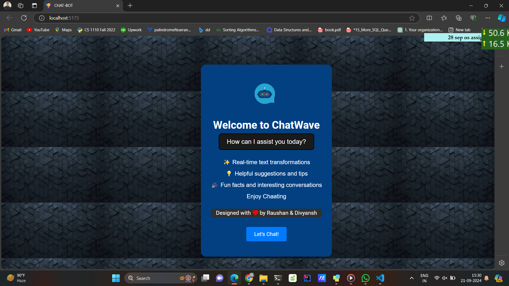
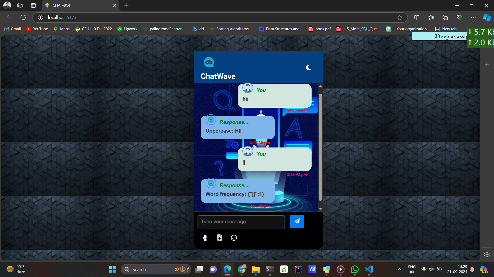

# ChatWave: Interactive Chatbot

Welcome to **ChatWave**, an interactive and fun chatbot built with **React.js** and **Vite**. The chatbot can engage in conversations, analyze user messages, perform text transformations, and respond with quirky and informative replies.




## Table of Contents
## Features

- **Real-time chat**: Communicate with the bot via text.
- **File upload**: Upload `.txt` files for analysis.
- **Voice chat**: Speak to the bot via voice commands.
- **Emoji support**: Add emojis to your messages using an interactive emoji picker.
- **Text transformations**: The bot responds with random transformations of your messages such as:
  - Word count
  - Vowel count
  - Palindrome check
  - Reversed text
  - ASCII values and more!
- **Dark/Light Mode**: Toggle between dark and light themes for a personalized chat experience.

## Installation

1. Clone the repository:
   ```bash
   git clone https://github.com/8MISHRA/Web-Development-Assignment-1.git
   ```
2. Navigate to the project directory:
   ```bash
   cd chatwave
   ```
3. Install the dependencies:
   ```bash
   npm install
   ```
4. Run the application:
   ```bash
   npm run dev
   ```

## Components

### 1. `App.jsx`
The core component that manages the chat's visibility and controls the flow of messages. It includes:
- `WelcomePage` to introduce the chatbot and let users start the conversation.
- `ChatWindow` where the conversation takes place.
- `MessageInput` to handle user input and file uploads.

### 2. `Bot.jsx`
Handles the bot's responses. It generates random text transformations like word count, vowel count, and more. The bot processes the user's message with quirky replies and interesting insights.

### 3. `ChatWindow.jsx`
Displays the messages in a neat chat interface. Supports both user and bot messages with respective timestamps and avatars. Includes dark and light mode for aesthetic customization.

### 4. `MessageInput.jsx`
Allows users to type their message, upload files, use voice commands, and insert emojis. Handles sending messages by text, file, or voice input.

### 5. `Navbar.jsx`
A simple navigation bar at the top of the chat window. It displays the chatbot's logo and offers a theme toggle between dark and light modes using FontAwesome icons.

### 6. `WelcomePage.jsx`
The landing page that greets users when they first open ChatWave. Users can see an introduction and a list of features before starting the chat. It has a delightful footer with a signature design from the creators.

## How It Works

### Message Flow
When a user sends a message:
1. The message is displayed in the chat window.
2. The bot analyzes the message and responds with one of its fun transformations (e.g., palindrome check or ASCII conversion).
3. The chat scrolls to the latest message, keeping the conversation smooth.

### Bot Responses
The bot processes each user message with random transformations, such as:
- **Vowel count**: Counts the number of vowels in the message.
- **Palindrome check**: Tells whether the message is a palindrome.
- **ASCII values**: Returns the ASCII values of each character.
- **Leetspeak**: Converts the message to "leet speak."

### File Uploads
Users can upload `.txt` files to the chatbot, which the bot reads and analyzes in a similar manner to text messages. The file content is parsed and transformed just like a normal message.

### Voice Chat
With speech recognition, users can dictate messages, and the chatbot will respond accordingly. 

### Emojis
Add fun to conversations with an emoji picker that integrates smoothly into the chat interface.

## Future Enhancements

- **Multi-language support**: Expand the bot's capabilities to support conversations in different languages.
- **Contextual responses**: Make the bot smarter by adding memory for previous messages.
- **UI enhancements**: Improve the UI for better user interaction and smoother animations.

## Credits

- **Developers**: Raushan & Divyansh
- **Frameworks Used**: React.js, Vite
- **Design Inspiration**: Simple, interactive chat interfaces with an educational twist.
- **Voice Recognition**: Utilizes the Web Speech API for voice input.
- **Emoji Picker**: Uses the `emojibase` library for a wide range of emojis.
- **Font Awesome Icons**: For the theme toggle and other icons.
## License
This project is licensed under the MIT License.

